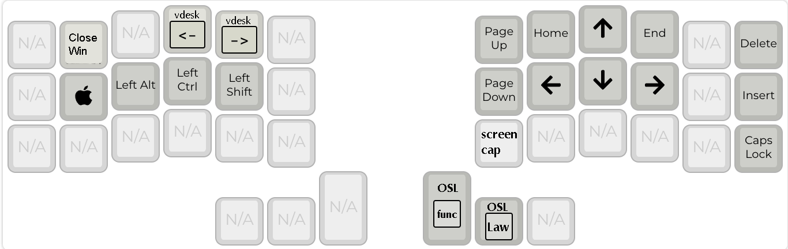
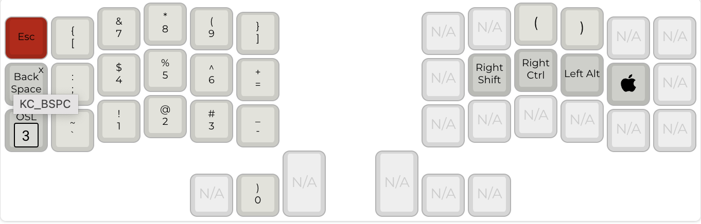
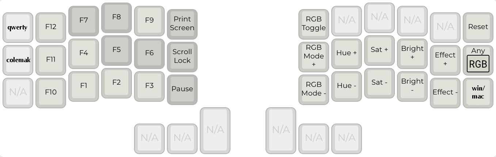
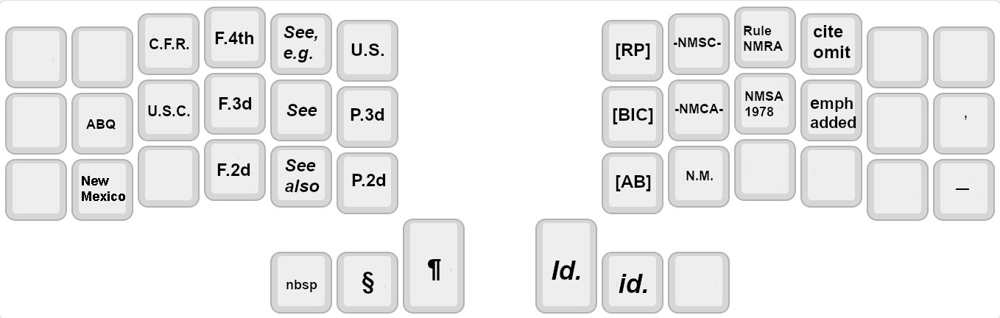

# dizave42


The lily58 was my first alternative keyboard and is still a favorite. I knew right away
however that I was going to want to go a bit smaller. I looked for a layout that worked on
both the lily and the corne and quickly found [miryoku](https://github.com/manna-harbour/miryoku). 

While miryoku is amazing and very well thought out, it leaves six keys unused on the 
six-column corne. That's 14% of the keys!!! And I just couldn't adjust to its nav layer.
After a good deal of thought and 
experimentation I decided to work on a pair of layouts for these two keyboards that were
inspired by miryoku but that made use of the extra keys.

In some ways this is inferior to simply using miryoku everywhere, an approach which 
provides the highest level of consistency between keyboards. But I doubt I'll 
ever go smaller than 42 keys, and I still do rock the lily from time to time. 
Anyway, this is what I've come up with so far to make my own typing life better.

## Design Goals

- Mostly compatible with the miryoku layout while taking
advantage of the extra keys on the lily58 and six-row corne
- Switch between windows and mac
- Support unicode characters on windows and mac
- Make better use of the display
- use something like bilateral combos to mitigate effect of home row rolls
- space key only means space

And, for my use case, the layout needs to accommodate both legal writing and programming.

## The Layouts

Currently dizave42 uses five layers. I'm at the point where I don't expect 
much to change. I am still playing with different ways to switch between them,
however.

### Colemak


This is my primary layer--standard colemak. I've departed from Miryoku in the
thumb cluster and of course in the sixth columns. I'm still experimenting with 
those two areas. 

The function layer lets you toggle between colemak and qwerty. I resisted this 
for a long time but then I needed to use WASD controls for a game and, well,
I couldn't do that with colemak. So now it is an option.

The layout uses home row mods in the GACS configuration (for windows) or CAGS (for mac). 
The mod keys change depending on whether the keyboard is in windows or mac
mode so that the most important key is under my middle finger regardless
of which OS I'm on (I switch constantly). In other words command-S and ctrl-S
to save are the same keystroke for me.

For a thorough overview of home row mods, check out
[precondition's page](https://precondition.github.io/home-row-mods).

I did have some problems with the home row keys, at least on the pinky and ring fingers. 
I've used [achordion](https://github.com/getreuer/qmk-keymap) to eliminate
the issues I was having with home row mod rolls. For my purposes, it is basically
a way to get bilateral combos but with userspace code. This made home row mods 
useable for me.

CAPS_WORD is enabled and configured to activate on a double tap of left shift. 

### Nav Layer


Most of this is self explanatory. There are some less obvious things:

- nav-Q: close key that is cmd Q on mac and alt F4 on windows
- nav-F and -P: keys to switch virtual desktops on windows or mac
- the home row keys on this layer are one-shot mods
- nav-dash: Screen capture, OS-aware.

I added word navigation, left and right, under the left and right 
arrows. These keys will go forward or back a word, at least in 
Microsoft Word, and are OS-aware. Nav-n is select word, which
is similar to word-right but holds shift down to select entire
words.

I tried using the VIM style arrows, I really did. But I just can't.
This is one area where I had to depart from Miryoku, the arrows
just didn't work for me. My brain needs up to be above down, not to
the right of it.

### Number Layer


Although in general I have tried to keep keys on the opposite side of the 
board from the corresponding layer key, I have made a small departure here.
The parentheses keys are duplicated under the index and middle fingers of the
right hand. I have found this easy and useful in many cases where I am entering
numbers (for example, when entering a phone number with area code).

Parens, brackets, and curly braces are on the right hand. One tap to get the open,
double tap to get the close. 


### Function Layer

Function keys. Accessed via one shot from the number layer. I
kept the left hand almost the same as Miryoku. I almost never use any of the keys on 
this layer. Qwerty and colemak keys switch the default layer between 
qwerty and colemak.

RGB controls are on the right half of this layer.

The lower left (DZ_WIN) switches between windows and mac mode. 

### Legal Layer


OK, so, admittedly this layer is only useful to people who are 
appellate lawyers in New Mexico and rock a corne or a lily. So,
just me. 

I put federal on the left and New Mexico on the right. Section is on
the "S" key for obvious reasons, "Albuquerque" is on the "A" key.
I'm still working my way through what should be on this layer.

The quote gives you a close quote single quote, the kind you use at
the beginning of a shortened patent number that can be such a pain to
enter.


## The Displays

I didn't find the display on the default keymap very useful. Although the
display itself is vertical, the text on it is horizontal. And the information
on the display wasn't particularly useful either, consisting mostly of information
about the most recently typed keys.

This keymap can be compiled for either twin 128x32 displays or for 
a 128x64 display.

### Small OLEDS

The left OLED mostly uses graphics from the images/128x32 directory.
There is one for each layer. It shows what layer you are in, whether
caps lock is on, and whether the keyboard is in windows or mac
mode.

The right side displays my useless dizave42 logo.

TODO: put the modifiers back in

The dizave42 uses home row mods in the GACS configuration (for windows) or CAGS (for mac).
The display will show either a windows or mac symbol to indicate which mode the keyboard is in.
The display also shows the home row mods as either CAGS or GACS. When a modifier is
pressed, that modifier is highlighted in the display.

### Large OLEDs
On the large OLED version, when the number layer is active, the left display shows the keymap for the main 5x3 keys.
If you hit shift it will show the shifted values. I took this out for 128x32 because there 
just isn't enough screen real estate.

## Lighting

There are per-key lighting changes to help show what layer is active:
- Navigation: the arrow keys turn gold
- Numbers: the number pad turns gold
- Law: many of the keys turn red
- Func: many of the keys turn blue
- Shift: the thumb clusters turn pink. This includes caps lock and the one shot shifts.

## Windows and Mac Mode

There is a key on the function layer to switch between windows and mac modes.
The keymap decides what mode it is in by looking at whether gui 
and control have been swapped. This setting is stored in the EEPROM
so it is persistent. The current status is shown in the OLED as an apple or a windows symbol. 

To make unicode work, I'm running wincompose on windows and using unicode
hex input on mac.

The main difference is that the gui and control keys are swapped. 
The keyboard also chooses its unicode mode based on which OS is 
configured.

# Builds

By default, it will compile for the promicro. But I only use KB2040's now.
To compile a .UF2 for the kb2040, use

```
qmk compile -e CONVERT_TO=kb2040
```

Whether to build for the 128x64 oled is also controlled from
the compile command. By default it will build for the 128x32. 
To build for the larger oled on RP2040, use:

```
qmk compile -e CONVERT_TO=kb2040 -e BIG_OLED=yes
```

# todo

- signals in the law layer?
- id. variants
- add irritating disco words like "interrogatory"