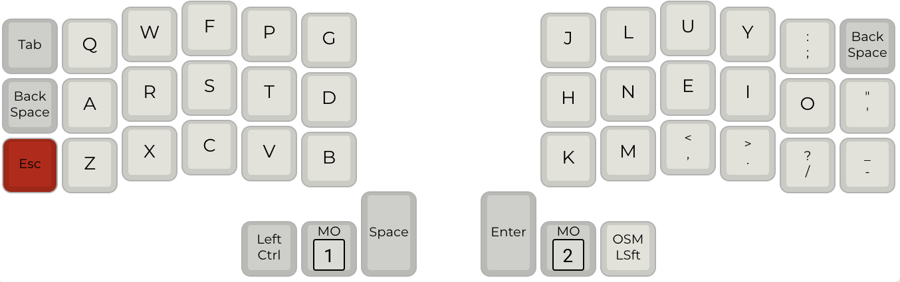

# dizave42


The lily58 was my first alternative keyboard and is still a favorite. I knew right away
however that I was going to want to go a bit smaller. I looked for a layout that worked on
both the lily and the corne and quickly found [miryoku](https://github.com/manna-harbour/miryoku). 

While miryoku is amazing and very well thought out, it leaves six keys unused on the 
six-column corne. That's 14% of the keys!!! And I just couldn't adjust to its nav layer.
After a good deal of thought and 
experimentation I decided to work on a pair of layouts for these two keyboards that were
inspired by miryoku but that made use of the extra keys.

In some ways this is inferior to simply using miryoku everywhere, an approach which 
provides the highest level of consistency between keyboards. Nevertheless, I suspect there
are other people like me out there that like miryoku but wouldn't mind being able to use 
the extra keys when they are available. Hopefully this layout can fill that need.

## Design Goals

- Mostly compatible with the miryoku layout while taking
advantage of the extra keys on the lily58 and six-row corne
- Support both QWERTY and COLEMAK
- Switch between windows and mac
- Support unicode characters on windows and mac
- Make better use of the display
- use something like bilateral combos to mitigate effect of home row rolls

And, for my use case, the layout needs to accommodate both legal writing and programming.

## The Layouts

Currently dizave42 uses five layers. I'm at the point where I don't expect 
much to change. I am still playing with different ways to switch between them,
however.

### Colemak




This is my primary layer--standard colemak. I've departed from Miryoku in the
thumb cluster and of course in the sixth columns. I'm still experimenting with 
those two areas. For example I'm still trying to figure out backspace, hence having 
it in two places. I really liked it in the middle of the right thumb cluster but
other things were more important there. 

The layout uses home row mods in the GACS configuration (for windows) or CAGS (for mac). 
For a thorough overview of home row mods, check out
[precondition's page](https://precondition.github.io/home-row-mods).

I do have some problems with the home row keys, at least on the pinky and ring fingers. 
I've used [achordion](https://github.com/getreuer/qmk-keymap) to eliminate
the issues I was having with home row mod rolls. For my purposes, it is basically
a way to get bilateral combos but with userspace code. This made home row mods 
useable for me.

As described below,the mod keys change depending on whether the keyboard is in windows or mac
mode. This lets me keep the most important key under my middle finger regardless
of which OS I'm on (I switch constantly).

CAPS_WORD is enabled and configured to activate on a double tap of left shift. I
meant for this to be used with the two one shot shifts in the thumb clusters.

### Nav Layer


- close key that is cmd Q on mac and alt F4 on windows
- key to switch virtual desktops on windows or mac
- the home row keys on this layer are one-shot mods

I tried using the VIM style arrows, I really did. But I just can't.
This is one area where I had to depart from Miryoku, the nav layer
just didn't work for me. My brain needs up to be above down, not to
the right of it.

### Number Layer


Although in general I have tried to keep keys on the opposite side of the 
board from the corresponding layer key, I have made a small departure here.
The parentheses keys are duplicated under the index and middle fingers of the
right hand. I have found this easy and useful in many cases where I am entering
numbers (for example, when entering a phone number with area code).

The number layer also has the ability to configure the keyboard. In the upper
left, the top two keys are used to change the default layer go either QWERTY
(df(0)) or COLEMAK (df(1)).

Double tap the bracket keys to get curly braces.


### Function Layer

Function keys. Accessed via one shot from the number layer. I
kept this the same as Miryoku. I almost never use any of the keys on 
this layer.

RGB controls are on the right half of this layer.
The lower left (DZ_WIN) switches between windows and mac mode. 

### Legal Layer


OK, so, admittedly this layer is only useful to people who are 
appellate lawyers in New Mexico and rock a corne or a lily. So,
just me. 

I put federal on the left and New Mexico on the right. Section is on
the "S" key for obvious reasons, "Albuquerque" is on the "A" key.
I'm still working my way through what should be on this layer.

The quote gives you a close quote single quote, the kind you use at
the beginning of a shortened patent number that can be such a pain to
enter.

Some of this uses unicode. I'm running wincompose on windows and using unicode
hex input on mac.

## The Displays

I didn't find the display on the default keymap very useful. Although the
display itself is vertical, the text on it is horizontal. And the information
on the display wasn't particularly useful either, consisting mostly of information
about the most recently typed keys.

On the left display, I have changed the text to be displayed vertically. This
creates an obvious limitation: each line is only five characters. On the other 
hand, there are many more lines to work with.

At the top, it displays what layer is active. This is particularly important since 
the default layer can be either QWERTY or COLEMAK. The other available layers are
the navigation layer and the numbers layer.

The dizave58 uses home row mods in the GACS configuration (for windows) or CAGS (for mac).
The display will show either a windows or mac symbol to indicate which mode the keyboard is in.
This will also (eventually) also indicate which unicode mode is current, windows or mac.

The display also shows the home row mods as either CAGS or GACS. When a modifier is
pressed, that modifier is highlighted in the display.

Finally, the display will show "CAPS" when the caps lock is on.

When the number layer is active, the left display shows the keymap for the main 5x3 keys.
If you hit shift it will show the shifted values.

## Windows and Mac Mode

There is a key on the function layer to switch between windows and mac modes.
The keymap decides what mode it is in by looking at whether gui 
and control have been swapped. This setting is stored in the EEPROM
so it is persistent. The current status is shown in the OLED as an apple or a windows symbol. 

The main difference is that the gui and control keys are swapped. 
The keyboard also chooses its unicode mode based on which OS is 
configured.

# Builds

I use this on promicros and adafruit 2040s, so it has to compile for both platforms.
By default, it will compile for the promicro.
To compile a .UF2 for the kb2040, use

```
qmk compile -e CONVERT_TO=kb2040
```


# todo

- add a qwerty layer
- signals in the law layer?